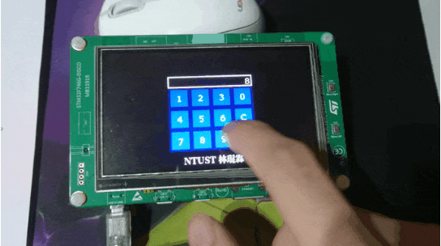

# Embedded System STM32F7-DISCO LCD Projects

## lab01_uart
Simply display text on LCD using the BSP(Board Support) library in `./lab01_uart/Drivers/BSP`.  
Change the text on user button pressed, print something on uart and blink led at different frequency.  
No touch screen envloed.
> Boring LCD displays and LED blinking, doesn't deserve a gif.

## lab02_pong_game
A really simple pong game with only 4 possible angles.  
Speed adjustable.  

## lab03_minesweeper
[View Branch](https://github.com/qqq89513/Embedded-System-Design-Laboratory-Homework/commits/lab03)  
A Minesweeper💣 with custom mine counts and timer showing how much time you've played.  
GUI is implemented with touchGFX.  

## hw01_calc
[View Branch](https://github.com/qqq89513/Embedded-System-Design-Laboratory-Homework/commits/hw01)  
This is a simple calculator🖩 with a user friendly GUI on LCD and the input is acquired from the touch screen.  
GUI is implemented with touchGFX.  

