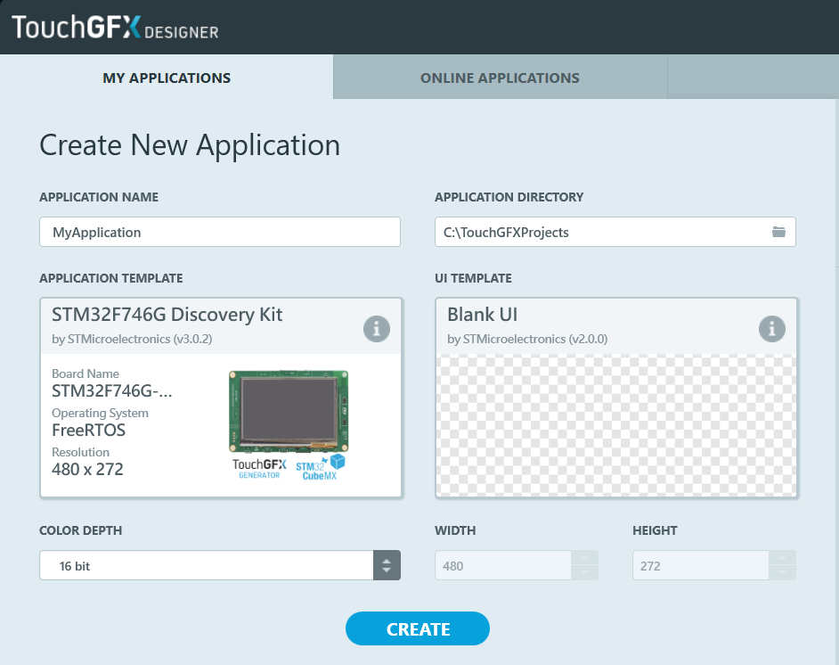
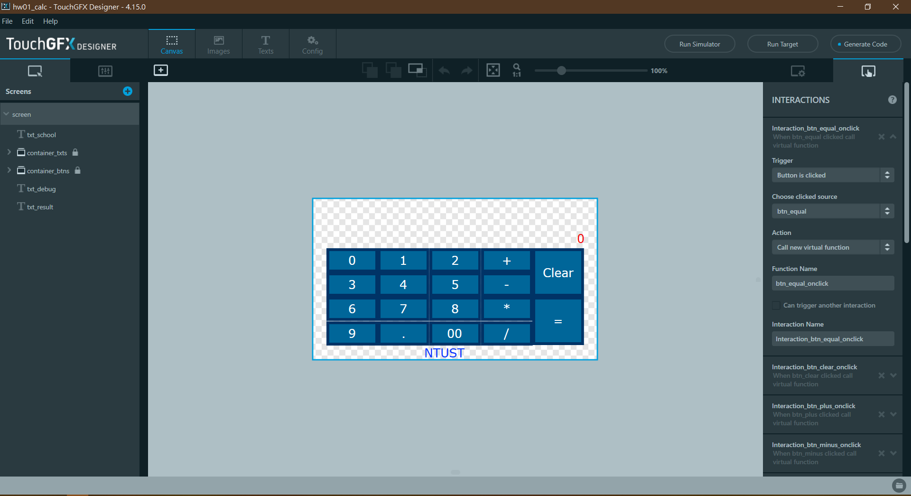

# Touchscreen Calculator with TouchGFX


## Enviroment
- IDE: STM32CubeIDE 1.4.0  
- Toolchain: arm-none-eabi, GNU Arm Embedded Toolchain 9-2020-q2-update 9.3.1  
- GUI: TouchGFX 4.15.0  
- OS: Windows 10
<br>

## File Structures
- Folder Tree
  ```c
  hw01_calc/
  ├── Core            // Top layer, main entry
  │   ├── Inc         // top layer header files
  │   └── Src         // main.c and interrupt subroutines here
  │
  ├── Drivers         // Mostly auto-generated, do not modify
  │   ├── BSP         // board support package
  │   ├── CMSIS
  │   ├── Components
  │   └── STM32F7xx_HAL_Driver
  │
  ├── Middlewares     // Touchgfx libraries
  │
  ├── STM32CubeIDE    // STM32CubeIDE relating
  │   ├── Debug       // object files and binrariesafter compile, it's gitignored
  │   └── .project    // stm32cubeIDE project file
  │
  ├── TouchGFX        // GUI
  │   ├── assets      // fonts, images, texts
  │   ├── build       // object files compiled by touchGFX
  │   ├── generated   // auto-generated, do not modify
  │   ├── gui         // User features implementation. It iss auto-generated only once.
  │   ├── hw01_calc.touchgfx  // touchGFX project file, json format
  │   ├── simulator   // Visual Studio simulator project
  │
  ├── hw01_calc.ioc   // CubeMX project file
  └── 嵌入式系統設計作業 -1.pdf // Homework description and requirement
  ```
- Important files  
  | Description                   | Path                                            |
  |-------------------------------|-------------------------------------------------|
  | STM32CubeIDE project          | ./STM32CubeIDE/.project                         |
  | TouchGFX                      | ./TouchGFX/hw01_calc.touchgfx                   |
  | Binrary                       | ./STM32CubeIDE/Debug/hw01_calc.bin              |
  | Features Implementaions       | ./TouchGFX/gui/src/screen_screen/screenView.cpp |
  | Visiual Studio                | ./TouchGFX/simulator/msvs/                      |
  | Simulaotr Makefile            | ./TouchGFX/simulator/gcc/Makefile               |
  | Simulator executable(windows) | ./TouchGFX/build/bin/simulator.exe              |
<br>

## TouchGFX UI Design Review
I was trying to build an STM32 GUI project with STM32CubeMX and TouchGFX from scratch. The compiler had no error nor warring but the display just didn't go as expected. After a while of struggling, I gave up and surrendered to the ready-to-go template.  
This project is based on the online templates of TouchGFX with a blank UI. As you can see, it's already configured to STM32F746G DISCO board.  
> Online templates of TouchGFX with a blank UI  
>   
<br>

Make sure that you have TouchGFX 4.15.0 installed, versions above/below this are un-tested.  
The officail documentations do a great job: [Creating Your Own Application](https://support.touchgfx.com/docs/tutorials/tutorial-02) and [Main Window Guide](https://support.touchgfx.com/docs/development/ui-development/designer-user-guide/main-window), so I won't talk about the basic workflow of touchGFX too much here. Instead, I will cover more about the UI design reviewing of this project.  
Open the project file of `./TouchGFX/hw01_calc.touchgfx`, you should see  
> `./TouchGFX/hw01_calc.touchgfx`  
> 
- Widgets  
  The widget list is located at the left pannel. The order of the following widgets implies the display layer. For example, `container_txts` is on the top of `container_btns`, so the texts *01234+-*/....* are not covered by buttons.
  1. `txt_school` A static text, required by assignment
  2. `container_txts` A container contains static text widgets on buttons. All widgets in a container can be moved or hidden all together.
  3. `container_btns` A container contains button widgets. All widgets in a container can be moved or hidden all together.
  4. `txt_degug` A text widget that display the debug messages. The *Invisible* attribute checkbox is canceled.
  5. `txt_result` A text that shows operands, the operator and the arthimetic result.
- Interactions  
  The interaction list is located at the right pannel. I'm not listing it one by one here. Every button invokes a corresponding callback function when it's clicked. The interaction name and the callback function name can be customized. The callback function name can be even duplicated, aka different buttons invoke a same callback function.
  Since clicking to create interactions for a thousand times is quite annoying, you can just edit `./TouchGFX/hw01_calc.touchgfx` as a json file. Remember to backup this project file before you edit it in case you break the structures.
  ```json
  {
  "Application": {
    "Screens": [
      {
        "Interactions": [
          {
            "InteractionName": "Interaction_btn_equal_onclick",
            "HasCompletedTrigger": false,
            "Trigger": {
              "Type": "TriggerClicked",
              "TriggerComponent": "btn_equal"
            },
            "Action": {
              "Type": "ActionCustom",
              "FunctionName": "btn_equal_onclick"
            }
          } ...
  ```