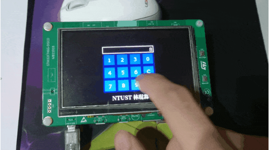

# Touchscreen 💣Minesweeper with TouchGFX
A Minesweeper💣 with custom mine counts and timer showing how much time you've played.  
GUI is implemented with touchGFX.  


## Enviroment
- IDE: STM32CubeIDE 1.4.0  
- Toolchain: arm-none-eabi, GNU Arm Embedded Toolchain 9-2020-q2-update 9.3.1  
- GUI: TouchGFX 4.15.0  
- OS: Windows 10
<br>

## File Structures
- Folder Tree
  ```c
  lab03_minesweeper/
  ├── Core            // Top layer, main entry
  │   ├── Inc         // top layer header files
  │   └── Src         // main.c and interrupt subroutines here
  │
  ├── Drivers         // Mostly auto-generated, do not modify
  │   ├── BSP         // board support package
  │   ├── CMSIS
  │   ├── Components
  │   └── STM32F7xx_HAL_Driver
  │
  ├── Middlewares     // Touchgfx libraries
  │
  ├── STM32CubeIDE    // STM32CubeIDE relating
  │   ├── Debug       // object files and binrariesafter compile, it's gitignored
  │   └── .project    // stm32cubeIDE project file
  │
  ├── TouchGFX        // GUI
  │   ├── assets      // fonts, images, texts
  │   ├── build       // object files compiled by touchGFX
  │   ├── generated   // auto-generated, do not modify
  │   ├── gui         // User features implementation. It iss auto-generated only once.
  │   ├── lab03_minesweeper.touchgfx  // touchGFX project file, json format
  │   └── simulator   // Visual Studio simulator project
  │
  ├── lab03_minesweeper.ioc   // CubeMX project file
  └── 實習題目–3踩地雷遊戲.pdf // Homework description and requirement
  ```
- Important files  
  | Description                   | Path                                            |
  |-------------------------------|-------------------------------------------------|
  | STM32CubeIDE project          | ./STM32CubeIDE/.project                         |
  | TouchGFX                      | ./TouchGFX/lab03_minesweeper.touchgfx           |
  | Binrary                       | ./STM32CubeIDE/Debug/lab03_minesweeper.bin      |
  | Features Implementaions(1)    | ./TouchGFX/gui/src/screen_screen/screenView.cpp |
  | Features Implementaions(2)    | ./TouchGFX/gui/src/screen_game_screen/screen_gameView.cpp |
  | Visiual Studio                | ./TouchGFX/simulator/msvs/                      |
  | Simulaotr Makefile            | ./TouchGFX/simulator/gcc/Makefile               |
  | Simulator executable(windows) | ./TouchGFX/build/bin/simulator.exe              |
<br>

## TouchGFX UI Design Review
Please refer [master/hw01_calc](https://github.com/qqq89513/Embedded-System-Design-Laboratory-Homework/tree/master/hw01_calc) for more information.